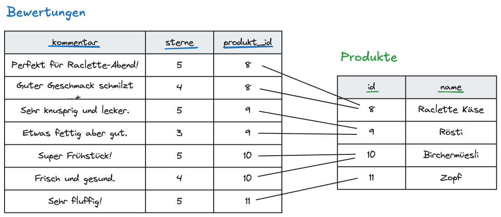

# SQL Joins

Joins bieten die Möglichkeit, zwei Tabellen miteinander zu verbinden. In diesem Script lernst du Schritt für Schritt, Joins anzuwenden.

Wir arbeiten mit einem kleinen Datensatz, welcher wie folgt aussieht:

- `produkte`: Produkte wie Raclette Käse, Rösti oder Zopf
- `bewertungen`: Kommentare und Sternebewertungen zu Produkten
- `kategorien`: Kategorien wie Schweiz, Vegetarisch oder Frühstück
- `produkt_kategorien`: Zwischentabelle für die n:m-Beziehung zwischen Produkten und Kategorien

## Repetition Select 

Mit `SELECT` wählen wir aus, welche Spalten wir anzeigen möchten. Wollen wir zum Beispiel den Namen und den Preis aller Produkte, benutzen wir das folgende Query:

```sql
SELECT name, preis
FROM produkte;
```

Erwartung: Du siehst alle Produkte, aber nur die Spalten `name` und `preis`.

### Aufgabe 1

Wir wollen diesen Befehl nun testen. Die Datenbank mit Produkten ist eingerichtet. Gehe dazu auf [https://sqlproject.coffee-journal.com/exercises/10](https://sqlproject.coffee-journal.com/exercises/10) und schaue dir an, welche Produkte in der `produkte` Tabelle vorkommen. Nimm dazu den oben genannten Befehl, schreibe ihn in den query editor, klicke auf "Run Query".

Nun solltest du die folgende Tabelle angezeigt bekommen:

TODO: Tabelle formatieren
name	preis
fondue	13
Maggi	13
pesto	3.9
Pasta Barilla	3.5
Spaghetti	2.5
...

### Aufagbe 2
Zeige nun mit einem geeigneten SELECT Befehl `kommentar` und die `sterne` aller Bewertungen an. Diese sind in der Tabelle `bewertungen` gespeichert


<details>
<summary>Lösung</summary>

```sql
SELECT kommentar, sterne 
FROM bewertungen;
```

Tabelle:
TODO: Tabelle formatieren
kommentar	sterne
Perfekt für Raclette-Abend!	5
Guter Geschmack, schmilzt gut.	4
Sehr knusprig und lecker.	5
Etwas fettig, aber gut.	3

</details>

## Die Idee von `JOIN`?

Die Bewertungen und Produkte sind nun in zwei verschiedenen Tabellen gespeichert. Wollen wir nun beide Tabellen in einer anzeigen, verwenden wir JOIN. Doch wie wissen wir, welche bewertung zu welchem Produkt passt? -> Schaue dir die Tabelle `bewertungen` an:

```sql
SELECT *
FROM bewertungen;
```

Du siehst nun die Spalte `produkt_id`. Diese besagt, zu welchem produkt die entsprechende Bewertung gehört. Mit einem Join bekommen wir nun die Produkte und Bewertungen beide in einer Tabelle zurück, wenn wir das richtig machen.

**Idee:**

- `bewertungen.produkt_id` zeigt auf `produkte.id`
- Diese beiden Spalten können wir miteinander verbinden
- Dafür verwenden wir `JOIN`

Wie sieht das Query aus?

```sql
SELECT bewertungen.kommentar, produkte.name FROM produkte 
JOIN bewertungen 
ON bewertungen.produkt_id = produkte.id;
```

Was passiert hier?

- SQL nimmt eine Zeile aus `produkte`
- SQL sucht passende Zeilen in `bewertungen`
- Passend bedeutet: `bewertungen.produkt_id = produkte.id`
- Das Resultat enthält Daten aus beiden Tabellen




-> Warum nun `bewertungen.kommentar`? Das ist weil nun beim JOIN haben wir mehr als nur eine Tabelle. Deshalb müssen wir noch sagen, **von wo** wir den Kommentar haben wollen.


⚡️ Probiere das oben genannte `JOIN` statement aus.

### Aufgabe 3


Zeige den `produkte.name` (name), `produkte.preis` (preis) und `bewertungen.seterne` (Anzahl Sterne) in einer tabelle an. Verwende dazu `SELECT` mit einem `JOIN` statement

<details>
<summary>Lösung</summary>

```sql
SELECT produkte.name, produkte.preis, bewertungen.sterne
FROM produkte
JOIN bewertungen ON bewertungen.produkt_id = produkte.id;
```

</details>

## Joins aneinanderhängen

Wenn wir n:m Beziehungen und somit eine Zwischentabelle haben, müssen wir mehrere Joins aneinanderhängen. Zum beispiel haben wir in unserer Datenbank zwei Tabellen `produkte` und `kategorien`, welche über die Zwischentabelle `produkte_kategorien` verbunden sind.

Hier brauchen wir **Zwei Joins**, um die Kategorien und Produkte in einer Tabelle darzustellen:

```sql
SELECT produkte.name AS produkt, kategorien.name AS kategorie 
FROM produkte 
JOIN produkt_kategorien ON produkte.id = produkt_kategorien.produkt_id
JOIN kategorien ON kategorien.id = produkt_kategorien.kategorie_id;
```

⚡️ Teste das Query im Editor aus!

-> Was bedeutet `AS`?

`AS` ist ein Schlüsselwort, das verwendet wird, um Spalten oder Tabellen umzubenennen. In diesem Fall wird es verwendet, um die Spalten `produkte.name` und `kategorien.name` umzubenennen, damit sie in der Ergebnistabelle einen aussagekräftigeren Namen haben. In dem Fall müssen wir das sogar, da `produkte` und `kategorien` beide eine Spalte `name` haben. Ohne `AS` wüsste SQL nicht, welche `name` Spalte wir meinen.

### Aufgabe 4

Versuchen wir nun, ein komplexes join query zu machen. Wir wollen wissen, welche Kategorien ungefähr welche Preise haben. Dazu wollen wir den `preis` aus `produkte` und den `kategorie` aus `kategorien` in einer Tabelle anzeigen. Verwende dazu `SELECT` mit zwei `JOIN` statements. Nenne `kategorien.name` `kategorie` und `produkte.preis` `preis`. (Mit `AS`)

<details>
<summary>Lösung</summary>

```sql
SELECT k.name AS kategorie, p.preis AS preis
FROM produkte AS p
JOIN produkt_kategorien AS pk ON p.id = pk.produkt_id
JOIN kategorien AS k ON k.id = pk.kategorie_id;
```

</details>


## Nur bestimmte verbundene Daten anzeigen

Wir können `JOIN` und `WHERE` kombinieren.

```sql
SELECT p.name, b.kommentar, b.sterne
FROM produkte AS p
JOIN bewertungen AS b ON b.produkt_id = p.id
WHERE b.sterne = 5;
```

### Aufgabe 5

Zeige alle Kommentare von Produkten an, welche höchstens 3 Sterne haben. Wir wollen `kommentar` und ` sterne` aus `bewertungen` und `name` aus `produkte` anzeigen.

<details>
<summary>Lösung</summary>

```sql
SELECT produkte.name AS produkt, bewertungen.kommentar as kommentar, bewertungen.sterne AS sterne
FROM produkte
JOIN bewertungen ON bewertungen.produkt_id = produkte.id
WHERE bewertungen.sterne <= 3;
```

</details>

## Zusammenfassung

Heute hast du gelernt:

- `SELECT` wählt Spalten aus
- `JOIN ... ON ...` verbindet Tabellen
- Wir können mehrere `JOIN`s aneinanderhängen
- Damit wir wissen, von welcher Tabelle die Spalte kommt, schreiben wir bei `JOIN`s: `tabelle.spalte`
- Mit `AS` kann man Spalten umbenennen
