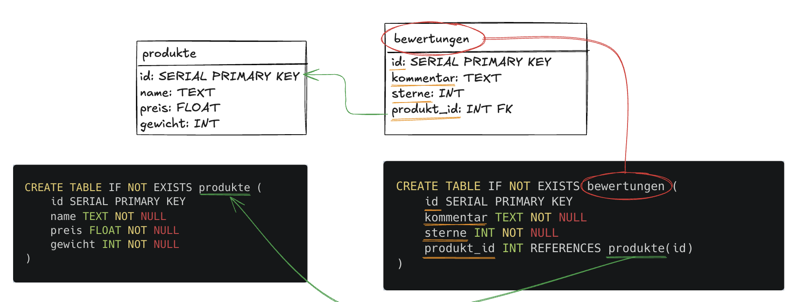

Here is the finished section for CREATE TABLE:

---

## Thema 1 – Datenschema programmieren

### Auftrag

Erstelle deine Tabellen in SQL anhand deines logischen Schemas:
- Erstelle **alle Tabellen** aus deinem Schema mit `CREATE TABLE`
- Dokumentiere einen Beispielbefehl und beschreibe in 1–2 Sätzen, was er macht

---

### Was ist CREATE TABLE?

Mit `CREATE TABLE` erstellen wir eine neue Tabelle in unserer Datenbank. Wir legen dabei fest, welche Spalten die Tabelle hat und welchen Datentyp jede Spalte hat.

**Beispiel:** Eine Tabelle für Produkte erstellen:

```sql
CREATE TABLE produkte (
  id INT PRIMARY KEY AUTO_INCREMENT,
  name VARCHAR(100),
  preis DECIMAL(10, 2)
);
```



Was passiert hier?
- `CREATE TABLE produkte` – wir erstellen eine neue Tabelle mit dem Namen `produkte`
- `id INT PRIMARY KEY AUTO_INCREMENT` – eine Spalte `id`, die automatisch hochzählt und jeden Eintrag eindeutig identifiziert
- `name VARCHAR(100)` – eine Textspalte mit maximal 100 Zeichen
- `preis DECIMAL(10, 2)` – eine Dezimalzahl, z.B. `3.50`

---

### Datentypen

Jede Spalte braucht einen Datentyp. Das sind die wichtigsten:

| Datentyp | Wofür | Beispiel |
|----------|-------|---------|
| `INT` | Ganze Zahlen | `15`, `200` |
| `DECIMAL(10,2)` | Dezimalzahlen | `3.50`, `19.90` |
| `VARCHAR(n)` | Text bis n Zeichen | `'Kaffee'` |
| `TEXT` | Langer Text | Ein Kommentar |
| `DATE` | Datum | `2024-03-15` |

---

### Fremdschlüssel (Foreign Key)

Wenn zwei Tabellen miteinander verbunden sind, brauchen wir einen **Fremdschlüssel**. Dieser verweist auf die `id` einer anderen Tabelle.

**Beispiel:** Eine Tabelle `bewertungen`, die mit `produkte` verbunden ist:

```sql
CREATE TABLE bewertungen (
  id INT PRIMARY KEY AUTO_INCREMENT,
  kommentar TEXT,
  produkt_id INT,
  FOREIGN KEY (produkt_id) REFERENCES produkte(id)
);
```

Was passiert hier?
- `produkt_id INT` – eine Spalte, die die `id` eines Produkts speichert
- `FOREIGN KEY (produkt_id) REFERENCES produkte(id)` – wir sagen der Datenbank, dass `produkt_id` auf die `id` in der Tabelle `produkte` verweist

> 💡 Der Fremdschlüssel stellt sicher, dass du keine Bewertung für ein Produkt erstellen kannst, das nicht existiert.

---

### Schritt für Schritt

**Schritt 1:** Schau dir dein logisches Schema an. Welche Tabellen musst du erstellen? Notiere alle Tabellen und ihre Spalten.

**Schritt 2:** Beginne mit den Tabellen, die **keine Fremdschlüssel** haben. Diese müssen zuerst erstellt werden, weil andere Tabellen auf sie verweisen.

> 💡 Wenn du Tabelle `bewertungen` vor `produkte` erstellst, gibt es einen Fehler – `produkte` existiert noch nicht.

**Schritt 3:** Schreibe das CREATE TABLE nach diesem Muster:
```sql
CREATE TABLE tabellenname (
  id INT PRIMARY KEY AUTO_INCREMENT,
  spalte1 DATENTYP,
  spalte2 DATENTYP
);
```

**Schritt 4:** Teste es im Query Editor mit **Run Query**. Erscheint keine Fehlermeldung? Dann hat es geklappt.

**Schritt 5:** Wiederhole das für alle Tabellen. Tabellen mit Fremdschlüsseln kommen zuletzt.

---

✅ Dokumentiere einen Beispielbefehl aus deinem Projekt und beschreibe in 1–2 Sätzen, was er macht.