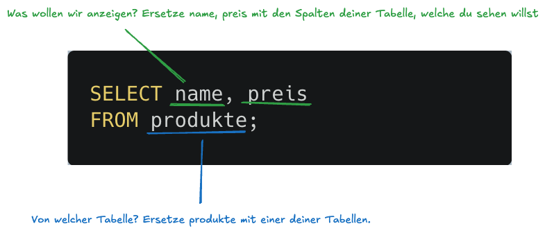

# Thema 3 - Select

## Auftrag
Wir haben den folgenden Auftrag:


**Programmierung**
Erarbeiten Sie sich **5** sinnvolle SELECT Queries. Die Queries werden dokumentiert (siehe unten) und später vorgetragen (siehe Vortrag). 

Für die 5 Queries haben wir die folgenden Anforderungen: 
- **Ein Query** mit einem Filter (WHERE) 
- **Zwei Queries** mit einer Aggretation (z.b SUM / AVG / ...) 
- **Zwei Queries** über mehrere Tabellen mit JOIN

**Dokumentation**
Dokumentieren Sie die jedes Query und beschreiben Sie jeweils kurz (1-2 Sätze), in welcher Situation dieses wichtig ist und wo sie verwendet werden. 

## Vorgehen

Öffne dein Projekt unter [https://sqlproject.coffee-journal.com](https://sqlproject.coffee-journal.com) und gehe zum [Query Editor](/projekt/sql-tool#query-editor). Geben wir wie immer unsere Befehle ein, um unsere Datenbank zu bearbeiten.

Das Ziel ist es nun, **5** `SELECT` Queries (Befehle) zu schreiben. 

## 1 - Ein Query mit einem Where Filter

Beginnen wir mit dem ersten:
**Ein Query** mit einem Filter (WHERE)

Ich würde damit beginnen, ein SELECT Query zu schreiben:
Select brauchen wir, um Daten **anzuzeigen**. Das heisst, dass wir die Einträge ausgeben und filtern, welche wir vorher im Thema 2 mit `INSERT` eingetragen haben.

In meinem Beispiel habe ich eine Tabelle `produkte`. Mit dem folgenden Query (Befehl) sehe ich den `namen` und den `preis` aller produkte:

```sql
SELECT name, preis
FROM produkte;
```

⚡️ Adaptiere dieses Query nun in deinem Projekt. Schreibe es in den Query editor und teste es mit `Run Query`. Wenn du eine Tabelle siehst, dann ist das gut! Anbei eine kurze Erklärung:




💡 [Wie sehe ich meine Tabellen?](/projekt/sql-tool#meine-tabellen)

Mit diesem `SELECT` Query sehen wir **Alle** Einträge in unserer Tabelle. Wir wollen diese aber nun **filtern** sodass wir nur **gewisse** Einträge sehen, welche **eine Bedingung** erfüllen.

Dazu müssen wir beim Query ein `WHERE` anfügen. In meinem Beispiel will ich alle Produkte sehen, dessen `preis` kleiner als 5 ist. Das heisst, alle Produkte, die weniger als 5 Franken kosten.

```sql
SELECT name, preis
FROM produkte
WHERE preis < 5;
```

⚡️ In deinem Query, überlege dir nun, welchen [Filter](/modul/where) du einsetzen könntest und füge diesen bei deinem Query ein.

✅ Fertig! Nun haben wir das erste Query mit `WHERE` erarbeitet. Dokumentiere dies nun in der docs Sektion und beschreibe in 2-3 Sätzen, was das Query macht. In meinem Fall wäre das zum Beispiel:

---

Mit diesem Befehl sehe ich alle Produkte, die weniger als 5 Franken kosten.
Dazu habe ich ein `WHERE` Statement benutzt mit dem Filter `preis < 5`. 

---

Sobald du das dokumentiert hast, kannst du den Editor wieder leerenund mit den nächsten zwei Queries (`JOIN`) fortfahren.

## 2 - Zwei Queries mit Join

Nun wollen wir eine SELECT Abfrage über **zwei Tabellen** machen. Das können wir mit `JOIN` machen. Kurz gesagt nehmen wir Daten aus zwei verschiedenen Tabellen und fügen diese zusammen. Für mehr Infos, schaue dir [JOINS](/modul/join) an. 

Wähle zwei Tabellen aus, welche unter einander in einer 1:n oder n:m Beziehung stehen. Bei mir sind das die Tabellen `produkte` und `bewertungen`.

Überlege dir, welche Eigenschaften du in der Tabelle haben willst. Bei meinem Beispiel bieten sich zum Beispiel `name`, `preis` und `kommentar` an. Um nun eine Abfrage über beide Tabellen zu machen, schreiben wir folgenden Query:

```sql
SELECT produkte.name AS produkte, produkte.preis AS preis, bewertungen.kommentar AS kommentar
FROM produkte
JOIN bewertungen ON produkte.id = bewertungen.produkt_id;
```

Adaptiere dieses Query nun in deinem Projekt:

Welche Eigenschaften möchtest du anzeigen?
-> schreibe dies bei `SELECT` zusammen mit der Tabelle, von welcher die Eigenschaft stammt. Verwende dazu `AS` um die Spalten im Ergebnis umzubenennen.

```sql
SELECT produkte.name AS produkte, produkte.preis AS preis, bewertungen.kommentar AS kommentar
```

-> Schreibe nun bei `FROM` und `JOIN` die Tabellen, welche du verwenden möchtest.
-> Mit `ON` müssen wir sagen, welche Eigenschaft aus der ersten Tabelle mit welcher Eigenschaft aus der zweiten Tabelle verbunden ist.

Bei meinem Beispiel:

```sql
FROM produkte
JOIN bewertungen ON produkte.id = bewertungen.produkt_id;
```

💡 Es ist egal, in welcher Reihenfolge die Tabellen aufgeführt werden. Solange die `ON` bedingung passt. In meinem Fall könnten wir auch produkte und bewertungen tauschen:

```sql
FROM bewertungen
JOIN produkte ON produkte.id = bewertungen.produkt_id;
```

### N:M Beziehung
(Musst du nicht unbedingt machen. Wenn du zwei Queries mit JOIN schon hast, dann kannst du diesen Teil überspringen)

Wenn du in deinen Daten eine n:m beziehung mit einer Zwischentabelle verbinden willst, musst du zwei JOINs verwenden. Gehe dazu gleich vor!

1. Wähle die zwei Tabellen aus, welche unter einander in einer n:m beziehung stehen (die Zwischentabelle ist hierbei nicht gemeint!)
2. Schaue, wie die Zwischentabelle heisst
3. Füge diese drei Tabellen mit `JOIN` statements zusammen

Bei meinem Beispiel will ich `kategorien` und `produkte` verbinden. Diese sind über die Zwischentabelle `produkt_kategorien` verbunden. Darum sieht mein Query wie folgt aus:

```sql
SELECT produkte.name AS produkte, produkte.preis AS preis, kategorien.name AS kategori
FROM produkte
JOIN produkt_kategorien ON produkte.id = produkt_kategorien.produkt_id
JOIN kategorien ON kategorien.id = produkt_kategorien.kategorie_id;
```


